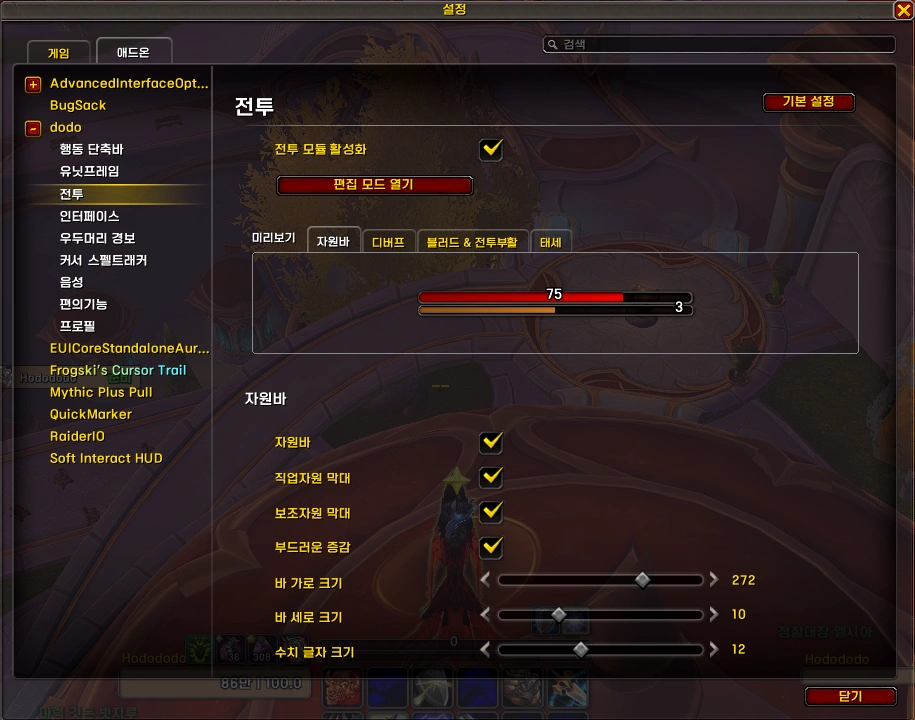
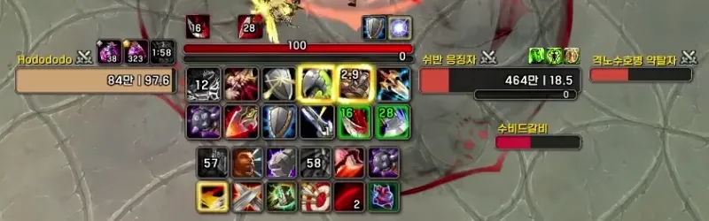
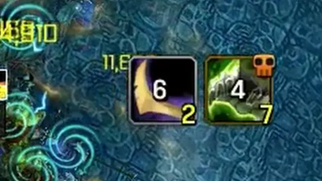
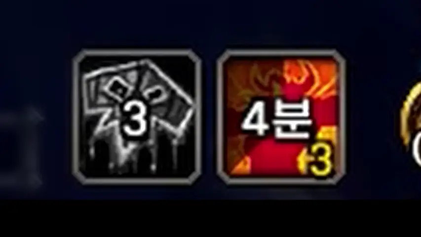
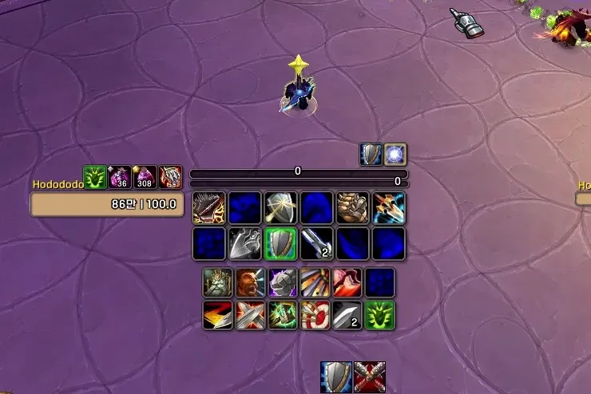

<!-- bundle exec jekyll serve --livereload -->
<!-- http://127.0.0.1:4000 -->
> '**Claude**'로 제작했습니다. (한밤 12.1.0 기준) 수시로 업데이트 합니다.
{: .prompt-warning }

## ■  참고한 애드온

[asPowerBar](https://www.curseforge.com/wow/addons/aspowerbar) (CurseForge)  
[Arc UI](https://www.curseforge.com/wow/addons/arc-ui) (CurseForge)  
[asDebuffFilter](https://www.curseforge.com/wow/addons/asdebufffilter) (CurseForge)  
[BResLustTracker](https://www.curseforge.com/wow/addons/breslusttracker) (CurseForge)  
[Enhance QoL](https://www.curseforge.com/wow/addons/eqol) (CurseForge)  
 

## ■  다운로드 및 설치

[dodo 다운로드](https://github.com/dsky3313/dodo/releases/latest){: .btn .btn--info} (GitHub)

압축 풀고, 모든 폴더를 애드온 폴더에 넣어주세요.
 
 

---

## ■  자원바

직업별 자원과 특성별 버프의 수치를 바 형태로 표시합니다.

- 설정 명령어: `/dd` 또는 `/ㅇㅇ` > **전투** > **자원바** 탭
- 위치 수정  : `/ed` 또는 `/ㄷㅇ`
 
 

### ■  직업자원 막대

현재 자원량을 바로 표시합니다.

| 직업 | 자원 |
|------|------|
| 죽음의기사 | 룬 마력 |
| 악마사냥꾼 | 격노 |
| 드루이드 (조화) | 달의 힘 |
| 드루이드 (야수) | 연계 점수 |
| 기원사 | 정수 |
| 사냥꾼 | 집중력 |
| 마법사 (비전) | 마나 |
| 수도사 (풍운) | 기 |
| 성기사 | 신성한 힘 |
| 사제 (암흑) | 광기 |
| 도적 | 기력 |
| 흑마법사 | 영혼 조각 |
| 전사 | 분노 |

 

### ■  보조자원 막대

직업별 보조자원, 혹은 버프의 스택 및 남은시간을 표시합니다.

재사용 대기시간 관리자에서 버프를 추적해야 합니다.

| 직업 | 특성 | 표시 내용 |
|------|------|----------|
| 죽음의기사 | 공통 | 룬 |
| 악마사냥꾼 | 복수 | 영혼 파편 (5스택) |
| 드루이드 | 수호 | 무쇠가죽 (스택 & 남은시간) |
| 기원사 | 증강 | 칠흑의 힘 (남은시간) |
| 마법사 | 비전 | 비전충전 (4틱) |
| 수도사 | 양조 | 시간차 |
| 도적 | 공통 | 콤보 포인트 (5틱) |
| 주술사 | 복원 | 응축되는 물 (3스택) |
| 전사 | 무기 | 휩쓸기일격 (18스택) |
| 전사 | 분노 | 회오리바람 (4스택) / 격노 (남은시간) |
| 전사 | 방어 | 고통감내 (100스택) |

 
 

---

## ■  디버프 아이콘

{: width="300" }  

플레이어에게 적용된 디버프를 화면 원하는 위치에 크게 표시합니다.

- 설정 명령어: `/dd` 또는 `/ㅇㅇ` > **전투** > **디버프** 탭
- 위치 수정  : `/ed` 또는 `/ㄷㅇ`  

- 순정 디버프 창과 독립적으로 작동
- 툴팁 지원
- Private Aura도 함께 표시
- 블러드 디버프는 표시 제외
 

디버프 종류에 따라 테두리 색상이 적용됩니다.

| 종류 | 색상 |
|------|------|
| 마법 | ■ 파랑 |
| 저주 | ■ 보라 |
| 질병 | ■ 노랑 |
| 독 | ■ 초록 |
| 출혈 | ■ 빨강 |
| 일반 | ■ 회색 |

 
 

---

## ■  블러드 & 전투부활

{: width="200" }  

블러드와 전투부활을 추적하는 프레임을 띄워줍니다.

- 설정 명령어: `/dd` 또는 `/ㅇㅇ` > **전투** > **블러드 & 전투부활** 탭
- 위치 수정  : `/ed` 또는 `/ㄷㅇ`  
 
 

### ■  블러드

블러드 디버프를 역추적하여 블러드 지속시간을 표시합니다.

| 상태 | 표시 |
|------|------|
| 블러드 시전 중 | 효과음 재생, 남은시간 표시, 녹색 오버레이 |
| 블러드 쿨 중 | 아이콘 회색, 남은시간 표시 |
| 대기 | 평상시 아이콘 |

추적 디버프 목록

| ID | 이름 | 스킬 |
|----|------|------|
| 57723 | 소진 | 영웅심 |
| 57724 | 만족함 | 피의 욕망 |
| 80354 | 시간 변위 | 시간왜곡 |
| 264689 | 피로 | 원초적 분노 |
| 390435 | 탈진 | 위상의 격노 |

 

### ■  전투부활

전투부활 스킬의 현재 충전수와 쿨다운을 표시합니다.

| 상태 | 표시 |
|------|------|
| 충전수 있음 | 아이콘 정상, 충전수 표시 |
| 충전수 없음 | 아이콘 회색, 쿨다운 스웨이프 |
 
 

---

## ■  태세아이콘

**전사 전용.** 전문화에 따른 태세가 활성화됐을 때 아이콘을 표시합니다.

- 설정 명령어: `/dd` 또는 `/ㅇㅇ` > **전투** > **블러드 & 전투부활** 탭
- 위치 수정  : `/ed` 또는 `/ㄷㅇ`  

| 스펙 | 알림 태세 |
|------|----------|
| 무기 / 분노 | 방어 태세 활성 시 표시 |
| 방어 | 공격 태세 활성 시 표시 |

 
 
