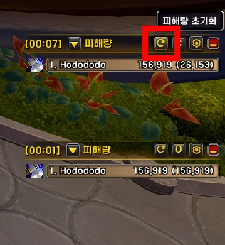
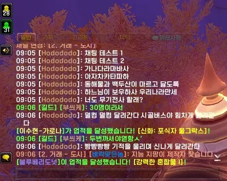
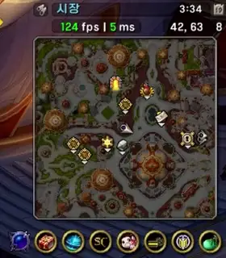
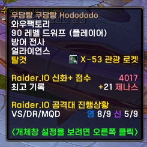
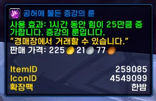

<!-- bundle exec jekyll serve --livereload -->
<!-- http://127.0.0.1:4000 -->
> '**Claude**'로 제작했습니다. (한밤 12.1.0 기준) 수시로 업데이트 합니다.
{: .prompt-warning }

## ■  참고한 애드온

[DamageMeterTools](https://www.curseforge.com/wow/addons/damagemetertools) (CurseForge)  
[Damage Meter Anchored](https://www.curseforge.com/wow/addons/damage-meter-anchored) (CurseForge)  
[Chattynator](https://www.curseforge.com/wow/addons/chattynator) (CurseForge)  
[HidingBar](https://www.curseforge.com/wow/addons/hidingbar) (CurseForge)  
[Leatrix Plus](https://www.curseforge.com/wow/addons/leatrix-plus) (CurseForge)  
[Simple FPS Ping](https://www.curseforge.com/wow/addons/simple-fps-ping) (CurseForge)  
[Enhance QoL](https://www.curseforge.com/wow/addons/eqol) (CurseForge)  
 

## ■  다운로드 및 설치

[dodo 다운로드](https://github.com/dsky3313/dodo/releases/latest){: .btn .btn--info} (GitHub)

압축 풀고, 모든 폴더를 애드온 폴더에 넣어주세요.
 
 

---

## ■  피해량 측정기

순정 피해량 측정기에 편의기능을 추가합니다.

- 설정 명령어: `/dd` 또는 `/ㅇㅇ` > **인터페이스** > **피해량 측정기** 섹션
 
 

### ■  창 붙이기 & 크기 동기화

세션 창을 여러 개 열었을 때 2, 3번 창을 1번 창 위에 자동으로 붙여줍니다.

| 기능 | 설명 |
|------|------|
| 창 붙이기 | 측정기 창을 추가하면 1번 창 위에 자동 고정 |
| 창 크기 동기화 | 1번 창 크기 변경 시 2·3번 창도 동일하게 맞춤 |

 

### ■  초기화 버튼

피해량 측정기 창 상단에 초기화 버튼을 추가합니다.  

- 클릭 시, 모든 전투 세션 기록 초기화
- 쐐기돌 시작 시, 자동으로 모든 세션 초기화
 
 

---

## ■  대화창

대화창에 편의기능을 추가합니다.

- 설정 명령어: `/dd` 또는 `/ㅇㅇ` > **인터페이스** > **대화창** 섹션
 

### ■  폰트 조정

대화창 글자 크기, 외곽선, 그림자를 조정합니다.

| 옵션 | 설명 |
|------|------|
| 글자 크기 | 기본값 13, 직접 입력 가능 |
| 외곽선 | 텍스트 외곽선 on/off |
| 그림자 | 텍스트 그림자 on/off |

 

### ■  URL 감지

대화창 속 URL을 클릭 가능한 링크로 자동 변환합니다.

- 링크 클릭 시 URL 복사 팝업 표시
- `http://`, `https://`, `www.` 등 다양한 패턴 감지
 

### ■  길드 버튼

`소셜`버튼 하단에 `길드` 버튼을 추가합니다.

- 호버 시 온라인 길드원 목록 표시 (이름, 지역, 직업 색상)
- 클릭 시 길드 창 열기
 
 

---

## ■  미니맵

미니맵에 기능을 추가합니다.

- 설정 명령어: `/dd` 또는 `/ㅇㅇ` > **인터페이스** > **미니맵** 섹션
 

### ■  사각형 미니맵

원형 미니맵을 사각형으로 변경합니다.
 

### ■  FPS / MS 표시

미니맵 좌측 상단에 FPS와 레이턴시(MS)를 표시합니다.

수치에 따라 색상이 변경됩니다.

| 색상 | FPS | MS |
|------|-----|----|
| ■ 초록 | 60 이상 | 100 이하 |
| ■ 노랑 | 30 ~ 59 | 101 ~ 200 |
| ■ 빨강 | 30 미만 | 200 초과 |

 

### ■  좌표 표시

미니맵 우측 상단에 플레이어 위치 좌표를 표시합니다.
 

### ■  줌 초기화

미니맵 줌 변경 후 일정 시간이 지나면 자동으로 초기화합니다.
 

### ■  애드온 아이콘 모음

미니맵 주변에 흩어진 애드온 아이콘들을 미니맵 아래에 한 줄로 정렬합니다.

기본 정렬 순서:

| 순서 | 애드온 |
|------|--------|
| 1 | 순정 확장팩 아이콘 |
| 2 | SimpleAddonManager |
| 3 | NotEvenClose |
| 4 | SimulationCraft |
| ... | 기타 |

기본 숨김: RaiderIO
 
 

---

## ■  툴팁

툴팁에 기능을 추가합니다.

- 설정 명령어: `/dd` 또는 `/ㅇㅇ` > **인터페이스** > **툴팁** 섹션
 

### ■  색상 변경

툴팁 테두리와 이름 색상을 대상에 맞게 변경합니다.

| 대상 | 색상 |
|------|------|
| 플레이어 | 직업 색상 |
| NPC | 적대 / 중립 / 우호 반응 색상 |
| 스킬 / 아이템 / 버프 / 매크로 | 금색 / 아이템 품질 색상 |

 

### ■  아이콘 표시

툴팁 이름 앞에 해당 아이템 또는 스킬의 아이콘을 표시합니다.

아이템, 스킬, 버프, 매크로 툴팁에 적용됩니다.
 

### ■  탈것 정보 표시

플레이어 툴팁에 현재 타고 있는 탈것의 이름과 아이콘을 표시합니다.
 

### ■  체력바 숨기기

툴팁 하단의 체력 게이지를 숨깁니다.
 

### ■  ID 표시

툴팁 하단에 ID 정보를 표시합니다.

| 항목 | 내용 |
|------|------|
| NPC ID | NPC GUID에서 추출 |
| ItemID | 아이템 ID |
| SpellID | 스킬 ID |
| IconID | 아이콘 ID |
| 확장팩 | 아이템이 추가된 확장팩 이름 |
| 기타 | 퀘스트, 업적, 화폐, 탈것 등 각종 ID |

 
 
