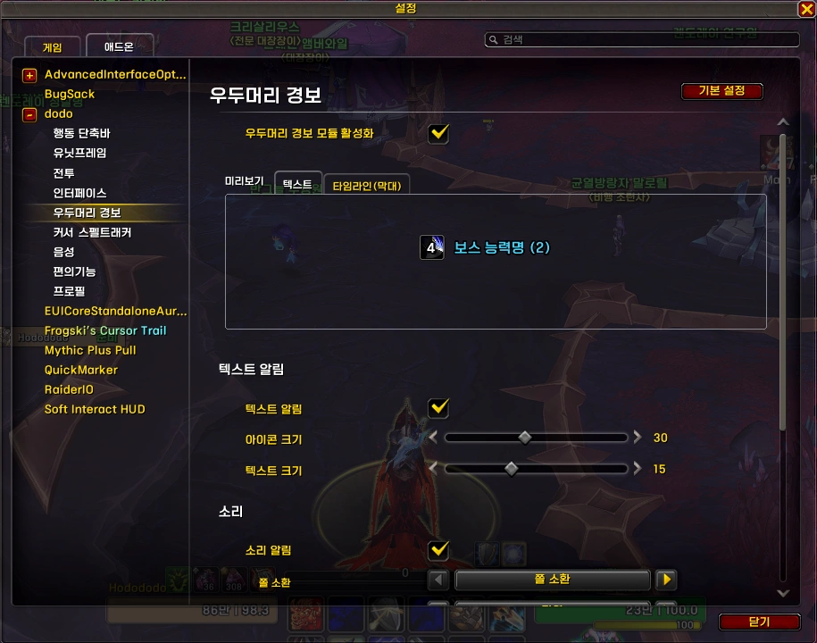
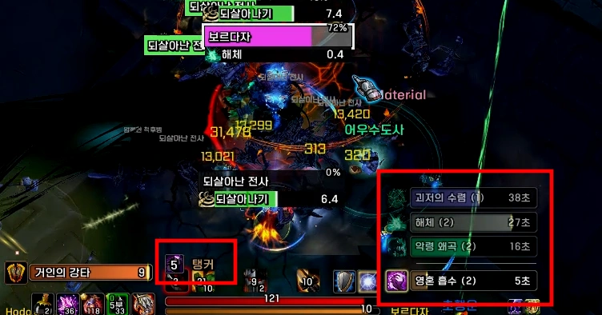
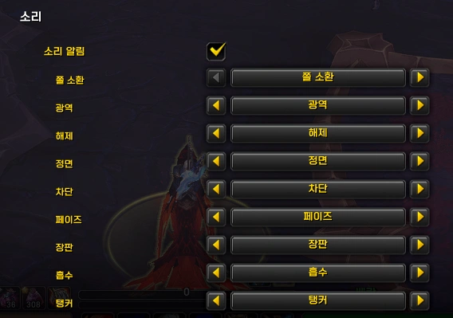

<!-- bundle exec jekyll serve --livereload -->
<!-- http://127.0.0.1:4000 -->
> '**Claude**'로 제작했습니다. (한밤 12.1.0 기준) 수시로 업데이트 합니다.
{: .prompt-warning }

## ■  참고한 애드온

[EXBoss](https://www.curseforge.com/wow/addons/exboss) (CurseForge)  
 
 

## ■  다운로드 및 설치

[dodo 다운로드](https://github.com/dsky3313/dodo/releases/latest){: .btn .btn--info} (GitHub)

압축 풀고, 모든 폴더를 애드온 폴더에 넣어주세요.
 
 

## ■  설명

블리자드 **우두머리 경보** 타임라인에 기능을 추가합니다.

- 설정 명령어: `/dd` 또는 `/ㅇㅇ` > **우두머리 경보**
- 위치 수정  : `/ed` 또는 `/ㄷㅇ`
 

### ■  타임라인 색상 변경

역할에 따라 타임라인 막대 색상을 변경합니다.

| 역할 | 색상 |
|------|------|
| 탱커 | 갈색 |
| 힐러 | 녹색 |
| 페이즈 | 보라색 |
| 쫄 | 하늘색 |
| 기타 | 회색 |

- 설정 : `/dd` > 우두머리 경보 > **타임라인 막대 ** 탭 > ☑ 타임라인 색상 변경
  - 5초 전 색상강조 : 경보 5초 전, 막대 색상을 빨간색으로 강조.
 

### ■  소리 알림

기술이 시전될 때 소리로 알립니다.

- 설정 : `/dd` > 우두머리 경보 > ☑ **소리 알림**
 

### ■  텍스트 알림

타임라인 5초 전, 화면에 아이콘과 텍스트를 표시합니다.

- 설정 : `/dd` > 우두머리 경보 > ☑ **텍스트 알림**
- 위치/크기 수정 : `/ed` 또는 `/ㄷㅇ` > **보스 알림**
 
 