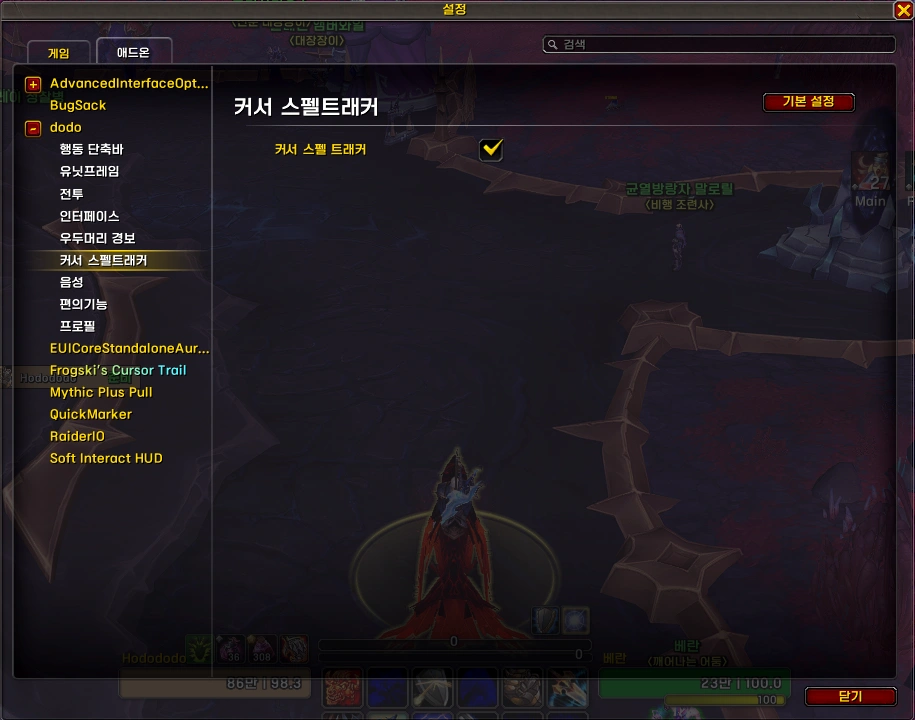

---
title: "커서 스펠트래커 &#124; dodo"
date: 2026-02-01 00:00:00 +0900

categories:
  - dodo
tags: [dodo]
description: 커서 스펠트래커 모듈 설명글

toc: true
image:
  path: cst1.webp
media_subpath: /_posts/dodo/2026-02-01-dodo-cursorspelltracker/
---
<!-- bundle exec jekyll serve --livereload -->
<!-- http://127.0.0.1:4000 -->
> '**Claude**'로 제작했습니다. (한밤 12.1.0 기준) 수시로 업데이트 합니다.
{: .prompt-warning }

## ■  참고한 애드온

[CursorSpellTracker](https://www.curseforge.com/wow/addons/cursorspelltracker) (CurseForge)  
 
 

## ■  다운로드 및 설치

[dodo 다운로드](https://github.com/dsky3313/dodo/releases/latest/download/dodo.zip){: .btn .btn--info} (GitHub)

압축 풀고, 모든 폴더를 애드온 폴더에 넣어주세요.
 
 

## ■  설명

현재 직업/특성의 주요 스킬 아이콘을 커서 근처에 표시합니다.

- 설정 명령어: `/dd` 또는 `/ㅇㅇ` > **커서 스펠트래커**

{: .normal }

아직 지원하는 기능이 **많이** 없습니다.  
언젠가 추가할 예정...
 

표시 정보:

| 정보 | 설명 |
|------|------|
| 쿨다운 스웨이프 | 남은 쿨다운 시각화 |
| 충전수 | 충전 스킬의 현재 충전 수 |
| 버프 글로우 | 특정 버프 활성 시 아이콘 반짝임 |
| 버프 지속시간 | 버프 남은 시간 시각화 |

 
 

## ■  지원 직업 / 특성

현재 지원하는 특성 목록입니다.

| 직업 | 특성 | 추적 스킬 |
|------|------|----------|
| 주술사 | 복원 | 영혼정화, 성난해일 |

 
 