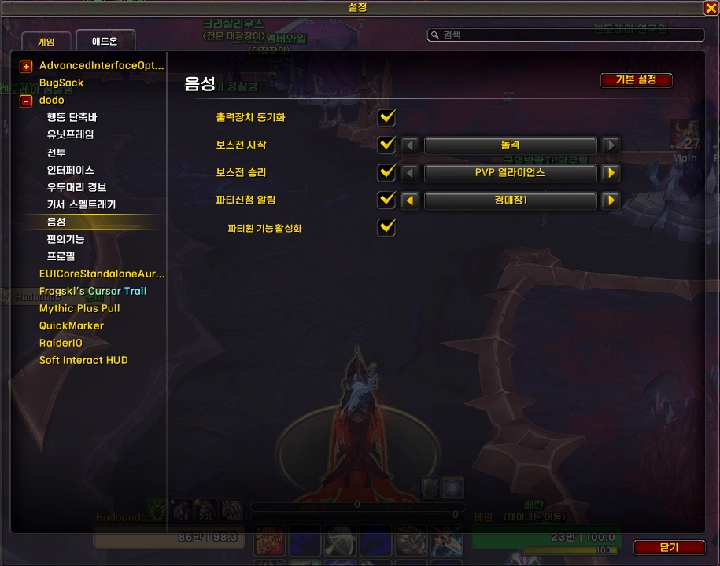
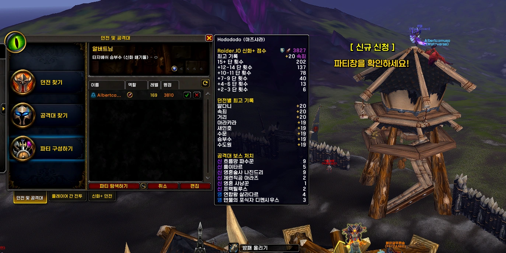

---
title: "음성 &#124; dodo"
date: 2026-02-03 00:00:00 +0900

categories:
  - dodo
tags: [dodo]
description: 음성 모듈 설명글

toc: true
image:
  path: sound_option.webp
media_subpath: /_posts/dodo/2026-02-03-dodo-sound/
---
<!-- bundle exec jekyll serve --livereload -->
<!-- http://127.0.0.1:4000 -->
> '**Claude**'로 제작했습니다. (한밤 12.1.0 기준) 수시로 업데이트 합니다.
{: .prompt-warning }

## ■  참고한 애드온

[Leatrix Plus](https://www.curseforge.com/wow/addons/leatrix-plus) (CurseForge)  
파티 구인 중 새로운 신청자 알림 위크오라 (Inven)  
 
 

## ■  다운로드 및 설치

[dodo 다운로드](https://github.com/dsky3313/dodo/releases/latest/download/dodo.zip){: .btn .btn--info} (GitHub)

압축 풀고, 모든 폴더를 애드온 폴더에 넣어주세요.
 
 

## ■  설명

오디오 관련 편의 기능을 제공합니다.

- 설정 명령어: `/dd` 또는 `/ㅇㅇ` > **음성**
 

### ■  출력장치 동기화

헤드셋 연결/해제 혹은 출력장치 변경 시, 자동으로 동기화하여 소리가 끊기는 문제를 방지합니다.
 

### ■  보스전 시작음

보스전 시작 시 효과음을 재생합니다.

| 효과음 |
|--------|
| 돌격 |

 

### ■  보스전 승리음

보스전 승리 시 효과음을 재생합니다.

| 효과음 |
|--------|
| PVP 얼라이언스 |
| 퀘스트 추가 |
| PVP 승리 |

 

보스전 시작음 또는 승리음이 활성화된 경우, 보스전 진입 시 배경음악을 자동으로 끄고 종료 시 다시 켭니다.
 

### ■  파티신청 알림

파티 구인 중 새로운 신청자 발생 시 알림을 줍니다.

- 화면에 알림 텍스트 표시 (7초 후 자동으로 사라짐)
- 파티창이 닫혀 있으면 자동으로 열어줌
- 레이드 / 쐐기돌 인스턴스 내에서는 비활성화
- **파티원 기능 활성화**: 파티원도 알림 받음 (기본: 파티장만)

효과음:

| 효과음 |
|--------|
| 멀록 |
| 경매장1 |
| 경매장2 |
| PVP1 |
| PVP2 |
| 퀘스트 |
| 레이드1 |
| 레이드2 |
| 인간여성 |

 
 