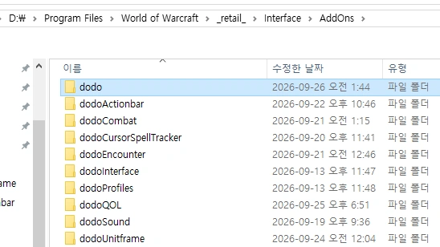
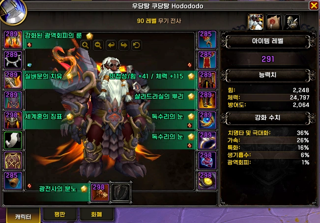
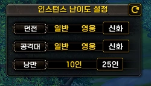
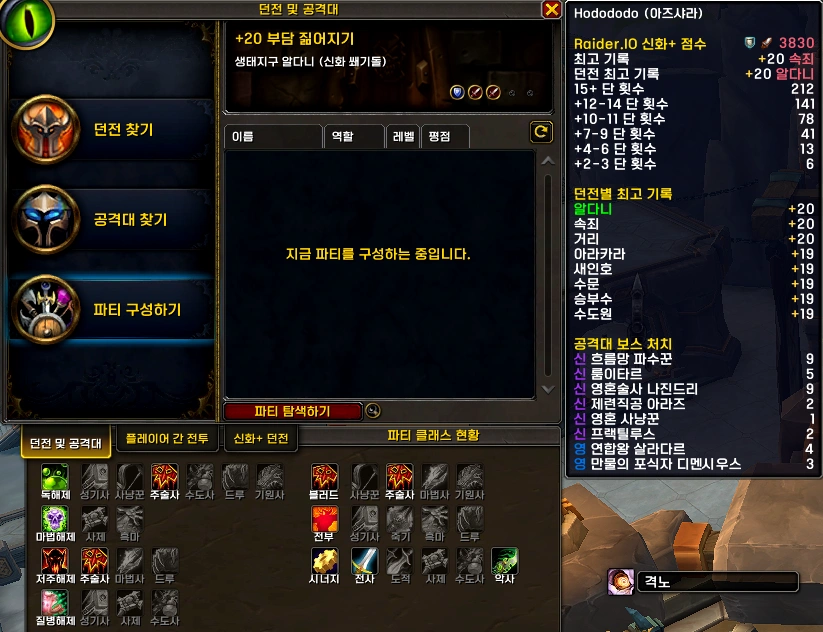
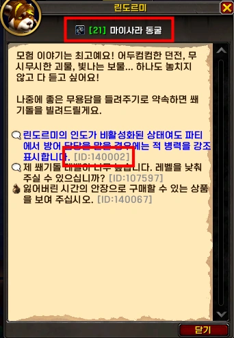
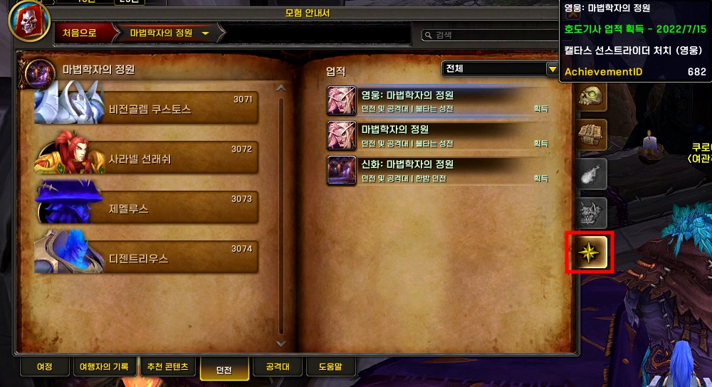
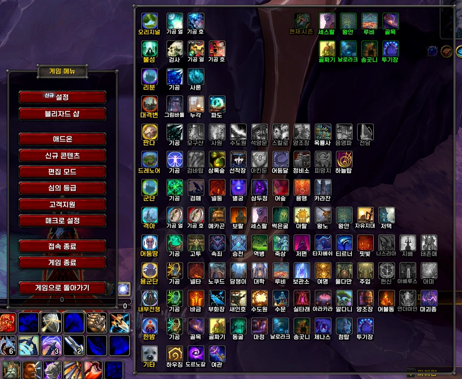

<!-- bundle exec jekyll serve --livereload -->
<!-- http://127.0.0.1:4000 -->
> '**Claude**'로 제작했습니다. (한밤 12.1.0 기준) 수시로 업데이트 합니다.
{: .prompt-warning }

## ■  다운로드 및 설치

[dodo 다운로드](https://github.com/dsky3313/dodo/releases/latest){: .btn .btn--info} (GitHub)

압축 풀고, 모든 폴더를 애드온 폴더에 넣어주세요.
 
 

## ■  설명

다양한 편의기능을 제공하는 모듈입니다.

- 설정 명령어: `/dd` 또는 `/ㅇㅇ` > **편의기능**
 

### ■  캐릭터 정보

| 기능 | 설명 |
|------|------|
| 아이템 레벨 및 마법부여 | 캐릭터창과 가방에 아이템 레벨, 마법부여, 보석 정보를 표시합니다. |

 

### ■  쐐기돌

| 기능 | 설명 |
|------|------|
| 인스턴스 난이도 | 인스턴스 난이도 선택 패널을 표시합니다. |
| 쐐기 타이머 개선 | +2/+3 쐐기돌 타이머를 표시하고, 퍼센트를 소수점까지 표시합니다. |
| 쐐기돌 자동 삽입 | 쐐기돌을 자동으로 슬롯에 삽입합니다. |
| 쐐기돌 목록 표시 | 파티 내 쐐기돌 목록 패널을 표시합니다. |
| 쐐기돌 굴림 알림 | 던전 클리어 후 쐐기돌을 굴리라는 알림을 보냅니다. |
| 전투준비 타이머 | 전투 준비 확인 시, 남은 시간 바를 표시합니다. |
| 시네마틱 건너뛰기 | 쐐기 중, 시네마틱을 자동으로 건너뜁니다. |

 

### ■  파티모집창

| 기능 | 설명 |
|------|------|
| 파티 탐색하기 버튼 | 파티원일 때도 파티 탐색하기 / 파티로 돌아가기 버튼을 표시합니다. |
| 파티 직업 및 유틸 | 파티찾기창에서 파티원 및 유틸 현황을 확인할 수 있습니다. |
| 파티만들기 빠른선택 | 파티 만들기 창에서 던전 빠른선택 버튼을 표시합니다. |

 

### ■  목표 추적기

| 기능 | 설명 |
|------|------|
| 인스턴스 자동 접기 | 인스턴스 진입 시 퀘스트 목록을 자동으로 접습니다. **(예정)** |
| 퀘스트 자동 수락 | 퀘스트를 자동으로 수락합니다. Shift 키를 누르면 건너뜁니다. |
| 퀘스트 자동 완료 | 보상 선택지가 없는 퀘스트를 자동으로 완료합니다. Shift 키를 누르면 건너뜁니다. |
| 퀘스트 아이템 단축키 | 현재 진행 중인 퀘스트 아이템을 사용하는 단축키입니다. **(ctrl+G)** |

 

### ■  NPC 대화창

| 기능 | 설명 |
|------|------|
| NPC ID 표시 | NPC 대화창 선택지·퀘스트에 ID를 표시합니다. |
| NPC 자동 선택 | M+ 던전 버프 NPC 대화를 자동으로 선택합니다. |
| 린도르미 현재돌 | 린도르미 NPC 대화창에 보유 쐐기돌 정보를 표시합니다. |

 

### ■  모험안내서

| 기능 | 설명 |
|------|------|
| 업적 탭 활성화 | 모험안내서에 업적 탭을 추가합니다. |
| ID 표시 | 모험안내서에 우두머리와 능력의 ID를 표시합니다. |

 

### ■  편의기능

| 기능 | 설명 |
|------|------|
| 시점 조절 | 카메라의 상하 시점을 조절합니다. |
| 최대 줌 | 카메라 줌아웃 최대 거리를 조정합니다. |
| 말풍선 글꼴 | 말풍선 글꼴을 변경합니다. |
| 말풍선 글꼴 크기 | 말풍선 글꼴 크기를 조정합니다. |
| 색상 선택기 개선 | 색상 선택기에 팔레트, 수치 입력 칸을 추가합니다. |
| 아이템 파괴 간소화 | 아이템 파괴 확인창에서 '지금파괴' 입력을 간소화합니다. |
| 말머리 크기 변경 | 대화 말머리 프레임 크기를 조정합니다. |
| 친구창 개선 | 친구 목록에 클래스 색상 및 추가 정보를 표시합니다. |
| 매크로창 개선 | 매크로 창 크기를 확장하고 아이콘 검색창 및 원클릭 매크로 생성 패널을 추가합니다. |
| 자동 판매 & 수리 | 상인 창을 열 때, 잡템 판매 및 장비 자동 수리를 진행합니다. |
| 플레이어 메모 | 플레이어별 메모를 관리하고, 같은 파티 진입 시 팝업 알림을 표시합니다. |
| 낚시찌 장난감 | 낚시 아이콘(전문기술) 옆에 낚시찌 아이템 버튼을 표시합니다. |
| 던전 텔레포트 메뉴 | ESC 메뉴에 순간이동 버튼을 표시합니다. |
| 던전찾기 타이머 | 던전찾기 수락창에 남은 시간을 표시합니다. |
| 월드맵 좌표 | 월드맵에 커서/플레이어 좌표와 맵 ID를 표시합니다. |
| 월드맵 커스텀 아이콘 | 월드맵에 경매장, 은행 등 커스텀 아이콘을 표시합니다. |
| 와우헤드 링크 | 퀘스트, 업적 창 하단에 와우헤드 링크 입력창을 표시합니다. |
| 하늘비행 HUD | 하늘비행 중 속도 바와 정수 충전 현황을 표시합니다. |

 
 