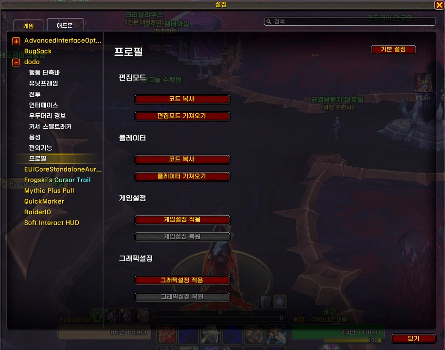

<!-- bundle exec jekyll serve --livereload -->
<!-- http://127.0.0.1:4000 -->
> '**Claude**'로 제작했습니다. (한밤 12.1.0 기준) 수시로 업데이트 합니다.
{: .prompt-warning }

## ■  다운로드 및 설치

[dodo 다운로드](https://github.com/dsky3313/dodo/releases/latest){: .btn .btn--info} (GitHub)

압축 풀고, 모든 폴더를 애드온 폴더에 넣어주세요.
 
 

## ■  설명

dodo 편집모드, 플레이터, 게임설정 프로필을 적용하는 모듈입니다.

- 설정 명령어: `/dd` 또는 `/ㅇㅇ` > **프로필**
 

### ■  편집모드

블리자드 **편집모드** 레이아웃을 가져옵니다.

- **코드 복사** : dodo 편집모드 레이아웃 코드를 클립보드에 복사합니다.
- **편집모드 가져오기** : 편집모드 가져오기 창을 자동으로 열어줍니다.
 

### ■  플레이터

**플레이터(Plater)** 네임플레이트 프로필을 가져옵니다.

- **코드 복사** : dodo 플레이터 프로필 코드를 클립보드에 복사합니다.
- **플레이터 가져오기** : 플레이터 프로필 가져오기 창을 자동으로 열어줍니다.
 

### ■  게임설정

최적화된 **게임설정(CVar)**을 일괄 적용합니다.

- **게임설정 적용** : 아래 목록의 설정값을 적용합니다. 적용 전 현재 설정을 자동으로 백업합니다.
- **게임설정 복원** : 백업된 게임설정으로 되돌립니다.

| 설정 | 값 | 설명 |
|------|----|------|
| deselectOnClick | 1 | 클릭 시 타겟 해제 |
| autoDismountFlying | 1 | 비행 중 자동 하차 |
| autoLootDefault | 1 | 자동 루팅 |
| SoftTargetInteract | 3 | 소프트 상호작용 타겟 |
| cameraWaterCollision | 0 | 카메라 수면 충돌 비활성화 |
| cameraSmoothStyle | 0 | 카메라 부드러움 비활성화 |
| showTutorials | 0 | 튜토리얼 비활성화 |
| Outline | 3 | 외곽선 |
| countdownForCooldowns | 1 | 쿨다운 카운트다운 표시 |
| enableMultiActionBars | 127 | 멀티 액션바 활성화 |
| showTargetOfTarget | 1 | 타겟의 타겟 표시 |
| chatStyle | im | 채팅 스타일 |
| showTimestamps | %H:%M | 채팅 시간 표시 |
| damageMeterEnabled | 1 | 피해량 측정기 활성화 |
| nameplateMaxDistance | 60 | 네임플레이트 최대 거리 |
| advancedCombatLogging | 1 | 고급 전투 로그 |
| cameraDistanceMaxZoomFactor | 2.6 | 최대 카메라 줌 거리 |

 

### ■  그래픽설정

최적화된 **그래픽설정(CVar)**을 일괄 적용합니다.

- **그래픽설정 적용** : 아래 목록의 설정값을 적용합니다. 적용 전 현재 설정을 자동으로 백업합니다.
- **그래픽설정 복원** : 백업된 그래픽설정으로 되돌립니다.

| 설정 | 값 | 설명 |
|------|----|------|
| vsync | 0 | 수직동기화 비활성화 |
| graphicsShadowQuality | 0 | 그림자 품질 최소 |
| graphicsLiquidDetail | 0 | 액체 디테일 최소 |
| graphicsParticleDensity | 1 | 파티클 밀도 최소 |
| graphicsSSAO | 0 | SSAO 비활성화 |
| graphicsDepthEffects | 0 | 심도 효과 비활성화 |
| graphicsComputeEffects | 0 | 컴퓨트 이펙트 비활성화 |
| graphicsOutlineMode | 1 | 외곽선 모드 활성화 |
| graphicsTextureResolution | 2 | 텍스처 해상도 |
| graphicsSpellDensity | 0 | 마법 효과 밀도 최소 |
| graphicsViewDistance | 0 | 시야 거리 최소 |
| graphicsEnvironmentDetail | 0 | 환경 디테일 최소 |
| graphicsGroundClutter | 0 | 지면 오브젝트 최소 |
| volumeFogLevel | 0 | 볼류메트릭 안개 비활성화 |
| weatherDensity | 0 | 날씨 효과 비활성화 |

 
 