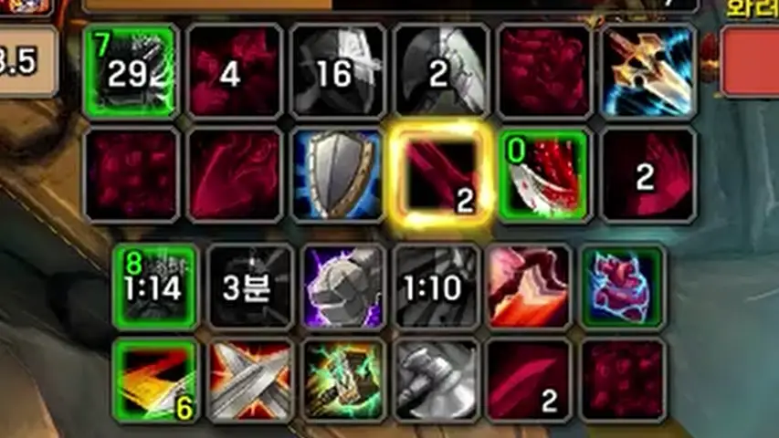
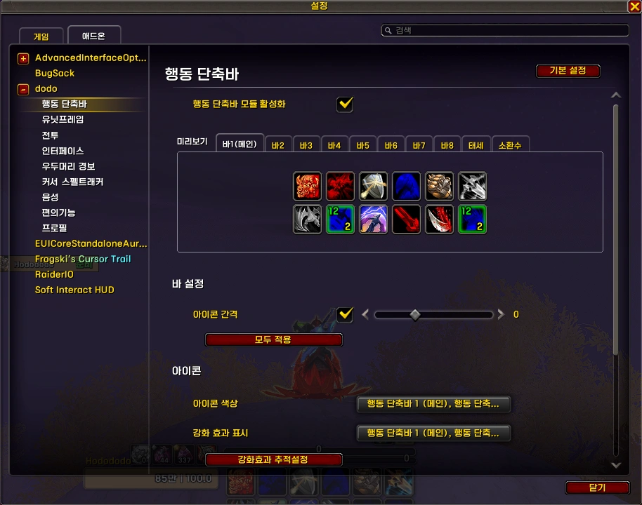
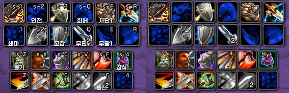
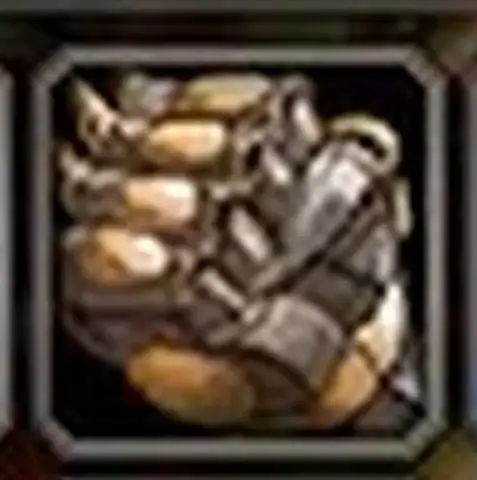
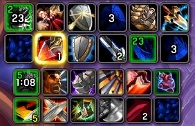
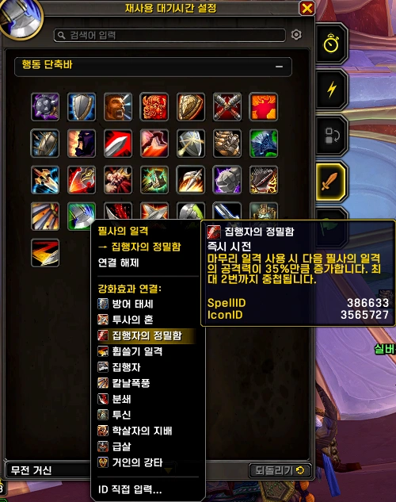
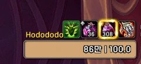

<!-- bundle exec jekyll serve --livereload -->
<!-- http://127.0.0.1:4000 -->
> '**Claude**'로 제작했습니다. (한밤 12.0.7 기준) 수시로 업데이트 합니다.
{: .prompt-warning }

## ■  참고한 애드온

[ActionBarsEnhanced](https://www.curseforge.com/wow/addons/actionbarsenhanced) (CurseForge)  
[CDMButtonAuras](https://www.curseforge.com/wow/addons/cdmbuttonauras) (CurseForge)  
[ActionBar Interrupt Highlight](https://www.curseforge.com/wow/addons/actionbarinterrupthighlight) (CurseForge)  
 

## ■  다운로드 및 설치

[dodo](https://github.com/dsky3313/dodo/archive/refs/heads/main.zip){: .btn .btn--info} (GitHub)

압축 풀고, 폴더명을 `dodo-main` > `dodo`로 변경 후, 애드온 폴더에 넣어주세요.
 

## ■  설명

  

블리자드 행동단축바에 기능을 추가합니다.
 
 

  

- 설정 명령어: `/dd` 또는 `/ㅇㅇ`
 
 

### ■  아이콘 색상

상태에 따라 아이콘의 색상을 변경합니다.

<!-- 이미지: 색상 비교 (기본 vs dodo) -->

| 상태 | 효과 |
|------|------|
| 사거리 밖 | ■ 파란색 |
| 마나 부족 | ■ 빨간색 |
| 쿨다운 & 사용불가 | ■ 회색 |

 
 

### ■  아이콘 간격

블리자드 편집모드에선 최소값이 2까지밖에 지원하지 않아서, -5까지 간격을 줄일 수 있게 만들었습니다.
 
 

### ■  단축키 / 매크로 텍스트

  

적용단축키 텍스트, 매크로 이름을 바별로 숨길 수 있습니다.
 
 

### ■  차단 오버레이

{: width="200" }  

대상 또는 주시대상이 스킬을 시전할 때, 차단 스킬 버튼에 오버레이와 남은시간을 표시합니다.

- 우선순위 : 주시대상 > 대상
 
 

### ■  강화효과 오버레이

강화효과 스킬의 남은 시간, 스택을 오버레이로 표시합니다.

재사용 대기시간을 켜고, 강화효과를 추적해야 활성화 됩니다.

해당 스킬들은 미리 추가되어 있습니다.

| 버프 | 연결 스킬 |
|------|----------|
| 집행자의 정밀함 | 필사의 일격 (무기 전사) |
| 격노 | 광란 (분노 전사) |
| 소용돌이 연마 | 소용돌이 (분노 전사) |

 

  

CDM 설정창에서 설정을 변경할 수 있습니다.
 
 

### ■  물약 오버레이

  

전투중, 물약을 사용가능하면 오버레이를 표시해줍니다.
 
 
