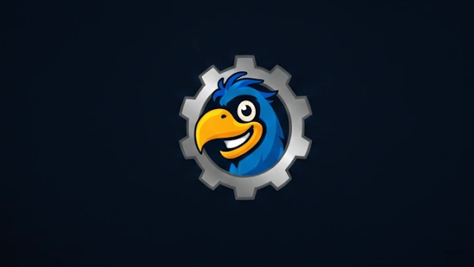

'**Claude**'로 제작했습니다. (한밤 12.1.0 기준)  
수시로 업데이트 합니다.
{: .prompt-danger }

## ■  다운로드 및 설치

[dodo](https://github.com/dsky3313/dodo/archive/refs/heads/main.zip){: .btn .btn--info} (GitHub)

압축 풀고,  

폴더명을 `dodo-main` > `dodo`로 변경 후, 애드온 폴더에 넣어주세요.
 
 

## ■  설명

  

순정 UI에 기능을 추가하고, 개인적으로 자주 쓰는 편의기능을 모아놓은 애드온입니다.

·[ 설정 명령어 ]: `/dd` 또는 `/ㅇㅇ`
 
 

## ■  기능 목록

클릭 시, 각 기능 설명 페이지로 이동합니다. (아직 작성중)

### ■  전투 관련
- [디버프 아이콘](https://dsky3313.github.io/dodo/dodo-combat2/) : 플레이어의 디버프를 원하는 위치에 크게 표시합니다.
- [블러드 & 전투부활](https://dsky3313.github.io/dodo/dodo-combat1/) : 블러드와 전투부활 현황을 추적하는 프레임을 표시합니다.
- [우두머리 경보](https://dsky3313.github.io/dodo/dodo-encounter/) : 막대 색상 변경, 소리 & 텍스트 알림을 추가합니다.
- [자원바](https://dsky3313.github.io/dodo/dodo-resourcebar/) : 직업별 자원과 특성 버프를 바 형태로 표시합니다.
- [피해량 측정기](https://dsky3313.github.io/dodo/dodo-damagemeter/) : 창 붙이기, 크기 동기화, 초기화 버튼을 추가합니다.
- [행동단축바](https://dsky3313.github.io/dodo/dodo-actionbar/) : 아이콘 색상, 버프·차단·물약 오버레이, 단축키 텍스트 등을 추가합니다.
- 유닛프레임 : oUF 기반 플레이어/대상/보스/파티 프레임을 추가합니다.

### ■  인터페이스 관련
- [미니맵](https://dsky3313.github.io/dodo/dodo-minimap/) : 사각형, FPS/MS, 좌표, 줌 초기화, 아이콘 모음 기능을 추가합니다.
- [카메라 기울기](https://dsky3313.github.io/dodo/dodo-cameratilt/) : 카메라 기울기를 조절합니다.
- 채팅창 : 폰트 조정, 길드 버튼, URL 감지 기능을 추가합니다.
- 툴팁 : 색상, 아이콘, ID, 상태바 등 툴팁 기능을 개선합니다.

### ■  편의기능 관련
- [NPC 대화창](https://dsky3313.github.io/dodo/dodo-gossipframe/) : 자동 선택, ID 표시, 린도르미 쐐기돌 표시를 추가합니다.
- [경매장 필터](https://dsky3313.github.io/dodo/dodo-expfilter/) : 경매장·주문제작 창에서 "현행 확장팩 전용"을 자동으로 활성화합니다.
- [말풍선](https://dsky3313.github.io/dodo/dodo-chatbubble/) : 말풍선 폰트와 위치를 조정합니다.
- [모험안내서](https://dsky3313.github.io/dodo/dodo-encounterjournal/) : 업적 탭과 능력·보스 ID 표시를 추가합니다.
- [순간이동](https://dsky3313.github.io/dodo/dodo-teleport/) : 순간이동 스킬 목록을 표시합니다.
- [새로운 신청자](https://dsky3313.github.io/dodo/dodo-newlfg/) : 파티모집 중 새로운 신청자가 생겼을 때 알림을 띄워줍니다.
- [인스턴스 난이도](https://dsky3313.github.io/dodo/dodo-insdifficulty/) : 인스턴스 난이도 변경창을 표시합니다.
- [지금파괴](https://dsky3313.github.io/dodo/dodo-deletenow/) : 아이템 삭제 과정을 간소화합니다.
- [캐릭터 정보창](https://dsky3313.github.io/dodo/dodo-characterframe/) : 아이템 레벨, 마법부여, 보석 정보를 표시합니다.
- [파티찾기 버튼](https://dsky3313.github.io/dodo/dodo-browsegroup/) : 파티원일 때도, "파티찾기" 버튼을 활성화 합니다.
- [파티 직업 표시](https://dsky3313.github.io/dodo/dodo-partyclass/) : 파티창 하단에 파티원 직업 및 유틸 현황을 표시합니다.
- [빠른 낚시찌](https://dsky3313.github.io/dodo/dodo-quickbobber/) : 전문기술창에서 낚시찌 장난감을 표시합니다.
- 파티 쐐기돌 : 파티원이 보유한 쐐기돌 정보를 표시합니다.
- 와우헤드 링크 : 해당 퀘스트 & 업적과 관련된 와우헤드 링크를 표시합니다.

<!--- 자세 : 자세 변환을 단축합니다.
- 색상 선택기 : 순정 색상 선택기를 개선합니다.
- 상인 : 상인 창에 편의기능을 추가합니다.
- 대기자 타이머 : LFG 대기 시간을 표시합니다.
- 공대 마킹 : 빠른 공대 마커 설정 기능을 추가합니다.
- 커서 스펠 추적 : 커서 위치에 시전 중인 스펠을 표시합니다.
- 쐐기돌 타이머 : 목표 추적기에 쐐기돌 남은 시간을 표시합니다.
- 세계지도 아이콘 : 세계지도에 커스텀 아이콘을 추가합니다. -->
 
 