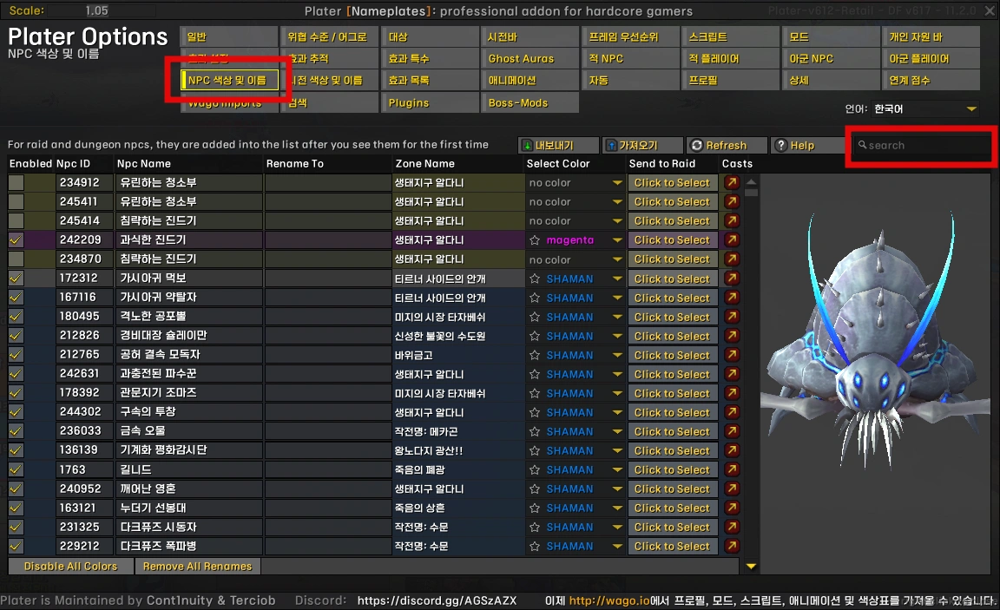
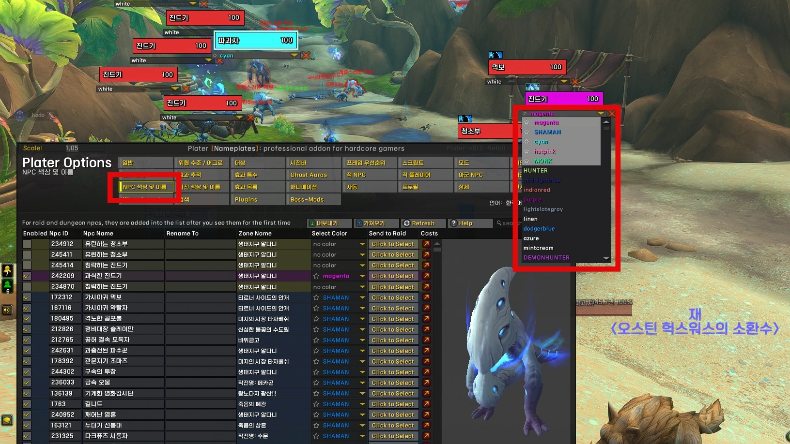
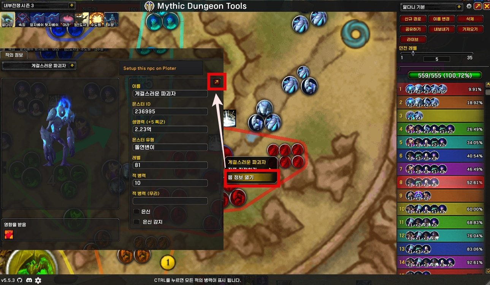
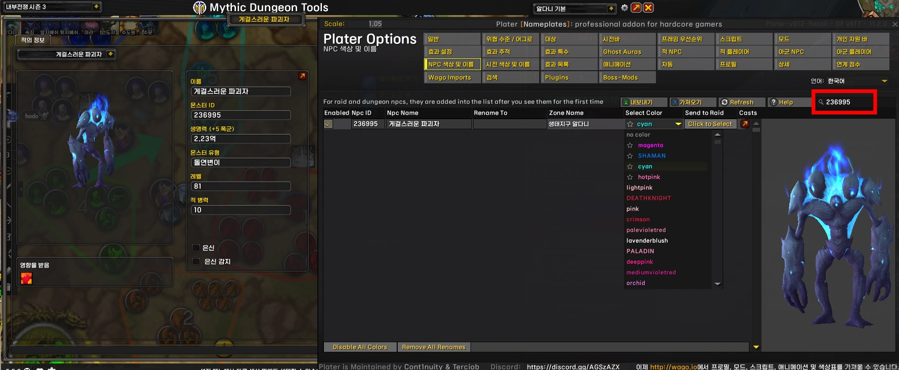

---
title: "플레이터 NPC 색상지정"
date: 2025-08-16 00:00:00 +0900
categories:
  - Plater
tags: [Plater info]
description: 플레이터 NPC 색상 및 이름 설정
toc: true
image:
  path: 2.webp
media_subpath: /assets/img/plater/2025-08-16-plater-npc-color/
---
## ■ 플레이터 NPC 색상 및 이름

**/Plater** &nbsp;&nbsp;>&nbsp;&nbsp; **NPC 색상 및 이름** 에서 기본적으로 몹들 색상을 지정할 수 있습니다.
 
 

## ■ 추종자 파티에서 설정

추종자 파티에서 **Plater NPC 색상 및 이름**를 켜면  
몹 이름 하단에 색상을 지정하는 리스트가 나옵니다.
 
 

## ■ MDT에서 설정

**MDT** &nbsp;&nbsp;>&nbsp;&nbsp; **몹 정보열기** 를 열어서 화살표를 누릅니다.

그럼 플레이터에 몹이 자동으로 검색되어 나타납니다.