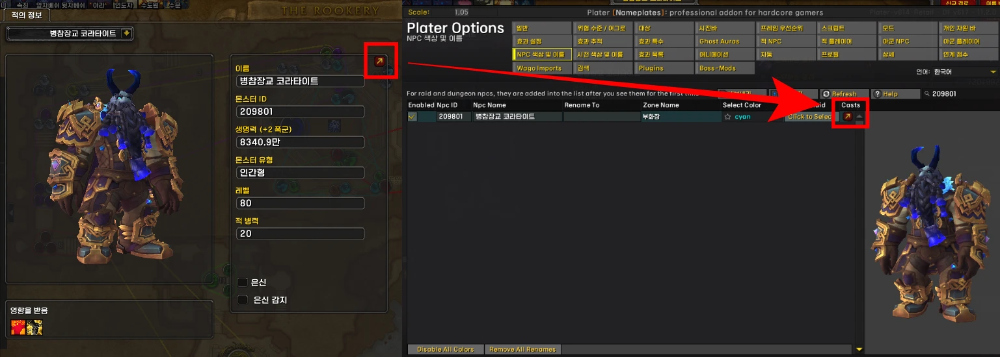
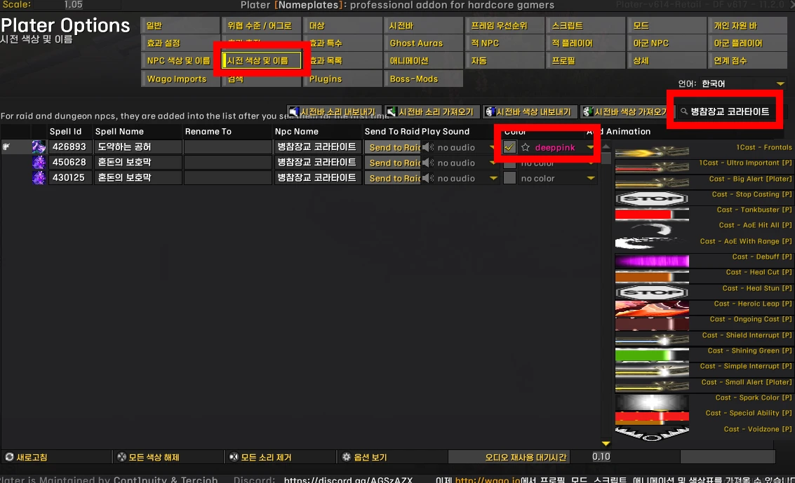
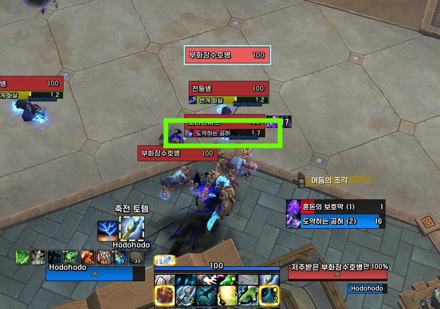
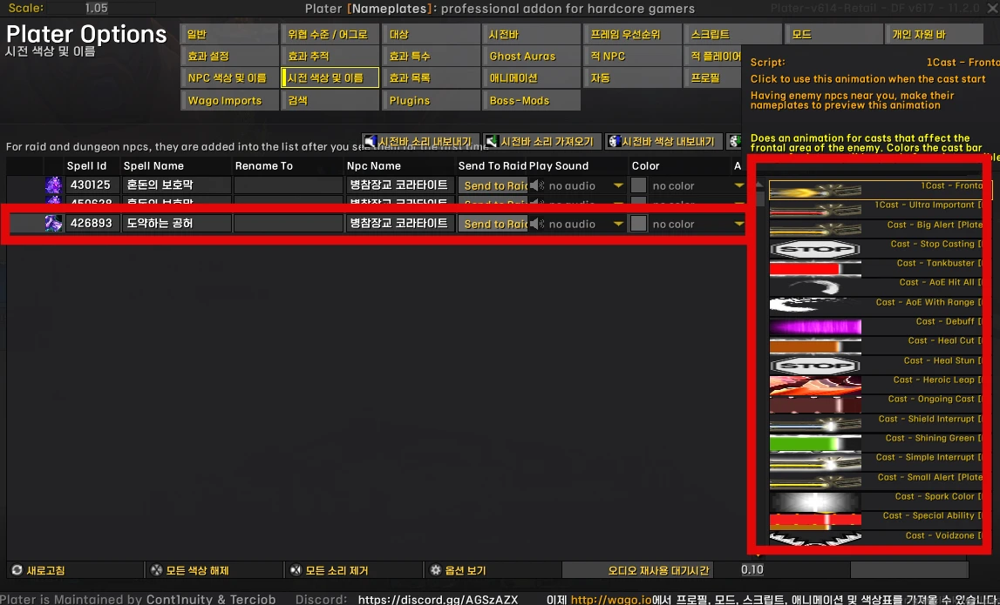
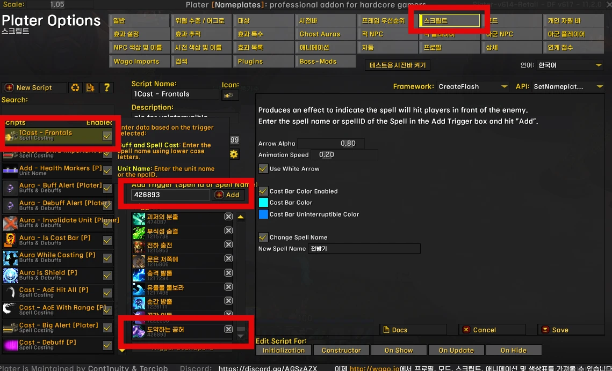
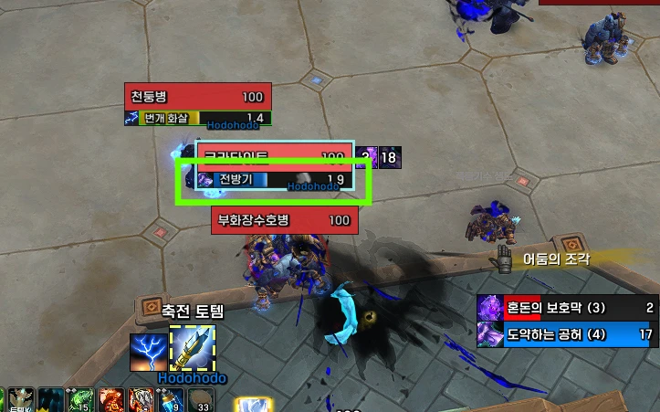

---
title: "플레이터 캐스팅바 색상지정"
date: 2025-08-19 00:00:00 +0900
categories:
  - Plater
tags: [Plater info]
description: 플레이터 시전바 색상 설정
toc: true
image:
  path: 0.webp
media_subpath: /assets/img/plater/2025-08-19-castbar-color/
---
## ■ MDT에서 설정

MDT에서 설정하고 싶은 몹을 선택 > **Casts** 클릭  
 

원하는 주문의 색상을 지정하면 됩니다.  
저는 전방기를 deeppink색으로 바꿔보았습니다.  
 

설정한 모습  
 
 

## ■ 스크립트를 이용한 설정

마찬가지로 **시전 색상 및 이름**
에서 옆부분 스크립트를 클릭하거나  
 

스크립트에서 직접 주문ID를 추가하면 됩니다.  
**1Cast - Frontals**와 **1Cast - Ultra Important [P]**는 따로 추가한 것,  
나머지 Cast 스크립트는 기본으로 제공되는 것입니다.  
이 스크립트 설정창에서 색깔을 따로 지정할 수 있습니다.
 

설정한 모습