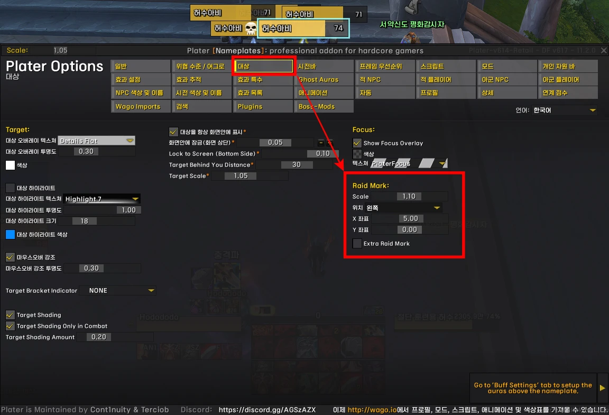
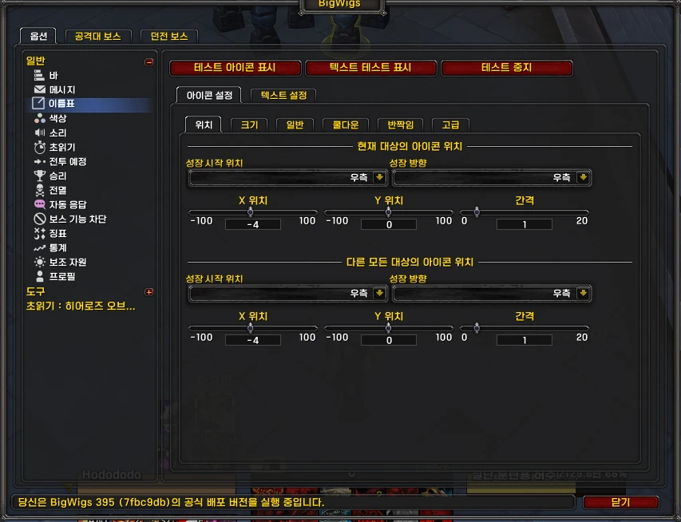
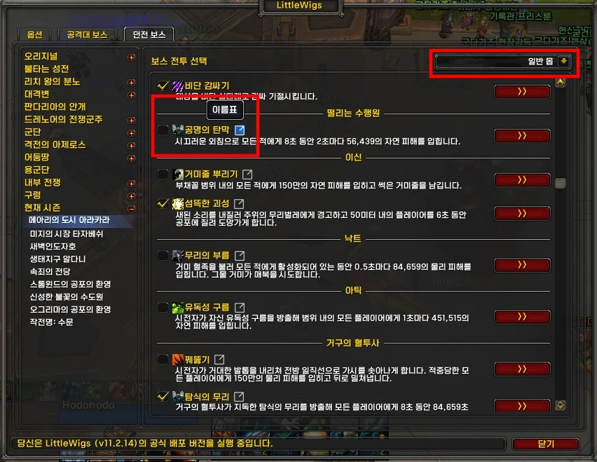
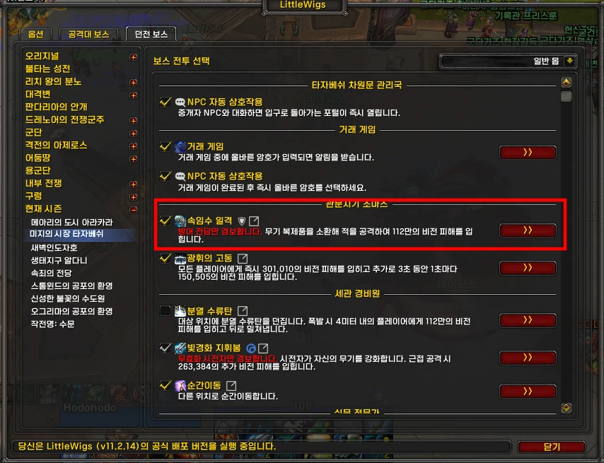
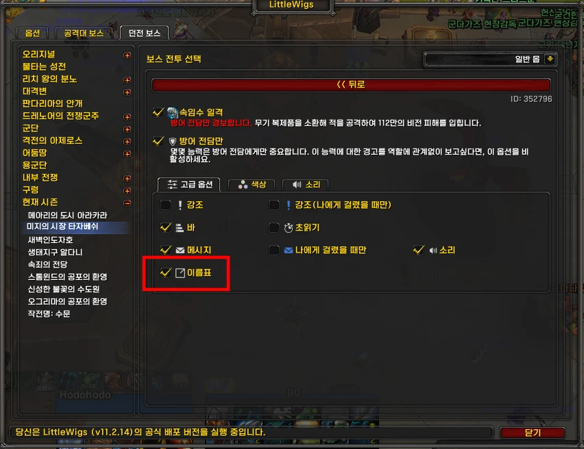

---
title: "플레이터 징표, 스킬쿨 설정"
date: 2025-08-19 00:00:00 +0900
categories:
  - Plater
tags: [Plater info]
description: 공격대표식 및 스킬쿨 설정
toc: true
image:
  path: 0.webp
media_subpath: /assets/img/plater/2025-08-19-raidmark/
---
## ■ 징표 설정

**/plater** > 
**대상** > 
**Raid Mark** 에서 위치, 크기 조절 가능합니다.  

저는 왼쪽으로 설정해놨습니다.
 
 

## ■ 스킬쿨 아이콘 설정

스킬쿨은 Bigwigs에서 설정합니다.

**/bigwigs** > 
**이름표** > 
**아이콘 설정** 에서 위치, 크기, 폰트 조절 가능합니다.

저는 오른쪽으로 설정해놨습니다.
 
 

## ■ 스킬쿨 끄는법

**/bigwigs** > 
**던전 보스** > 
**현재 시즌** 에서 던전별 경보설정 가능합니다.  
아무 던전이나 선택 후, 오른쪽 위 일반몹으로 바꾸면 쫄 스킬을 설정할 수 있습니다.  
이 중, **이름표** 라고 설정 되어있는 것을 체크해제 하시면 플레이터 옆에 뜨지 않습니다.  
 

이런식으로 여러개 설정되어 있는것은  
 

클릭하면 고급옵션에서 이름표만 따로 끌 수 있습니다.