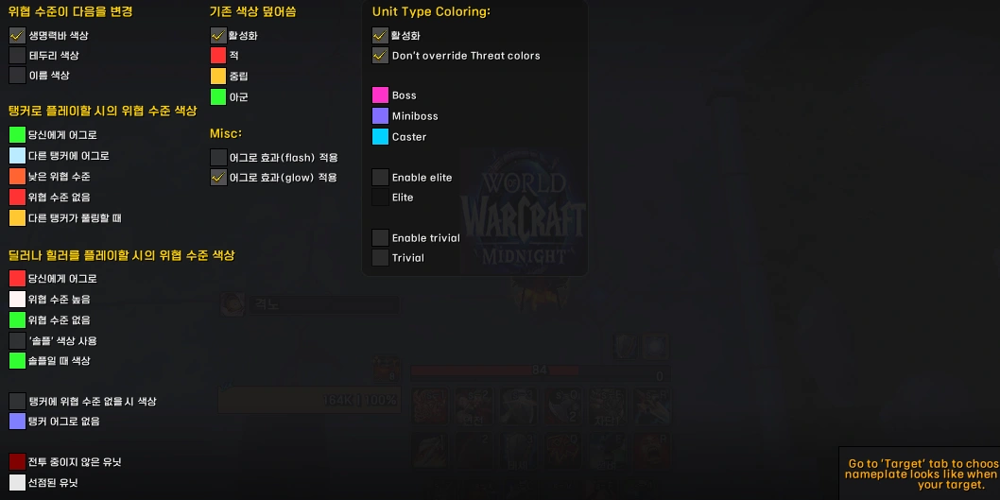
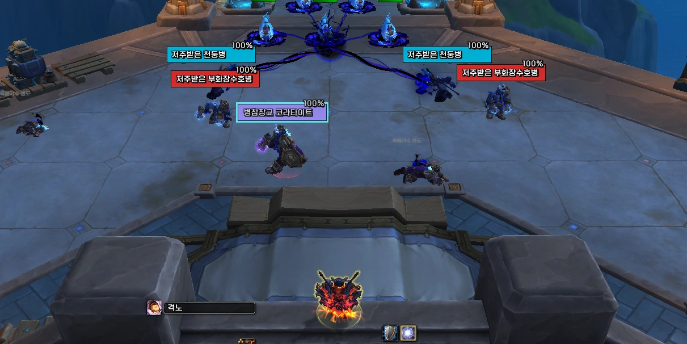
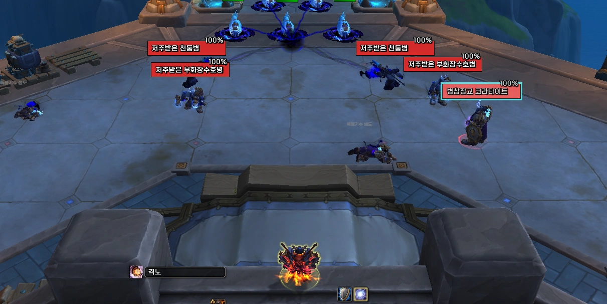
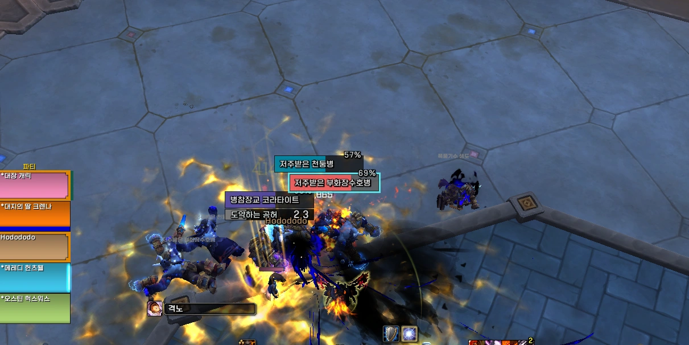
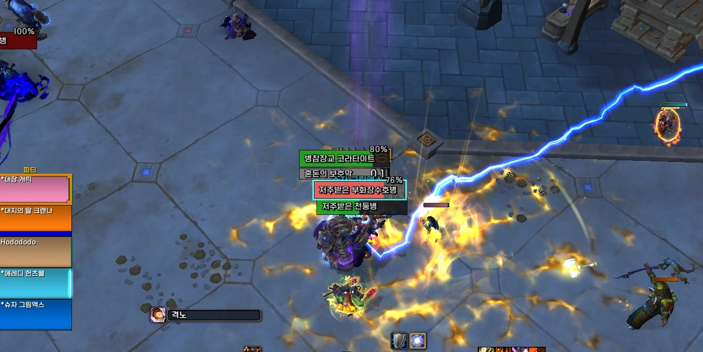

---
title: "플레이터 NPC 색상 설정 &#124; 와우 소한밤"
date: 2026-01-29 00:00:00 +0900
categories:
  - Plater
tags: [Plater info]
description: 소한밤 NPC 유닛 타입 색상 설정
toc: true
image:
  path: platernpccolor.webp
media_subpath: /assets/img/plater/2026-01-29-plater-npc-color-midnight/
---
## ■ NPC 색상지정 변경점

소한밤 업데이트 이후 NPC 체력바 색상을 직접 설정할 수 없으며,  

유닛 타입에 따라 지정되도록 변경되었습니다.

어그로 색상은 소한밤 패치 이전과 동일하게 사용하되,  

**Unit Type Coloring **부분을 손봐야 합니다.
 
 

## ■ Unit Type Coloring

**☑ **Unit Type Coloring  
☐ Don't override Threat colors  
 
 

☐ Unit Type Coloring  
☐ Don't override Threat colors  

- Unit Type Coloring 활성화 시, [ **넴드, 중보, 캐스터** ] 의 색상을 변경할 수 있습니다.
 
 

## ■ Don't override Threat colors

☑ Unit Type Coloring  
**☑ **Don't override Threat colors  

- 어글이 튀었을 때 빨간색, 나머지는 **Unit Type Coloring **의 색상을 따라갑니다.
 
 

☑ Unit Type Coloring  
☐ Don't override Threat colors  

- 전투 전에는 Unit Type Coloring 의 색상을 따라가다가,  
전투가 시작되면 **어그로 수치 관련 색상 **을 따라갑니다.
 
 